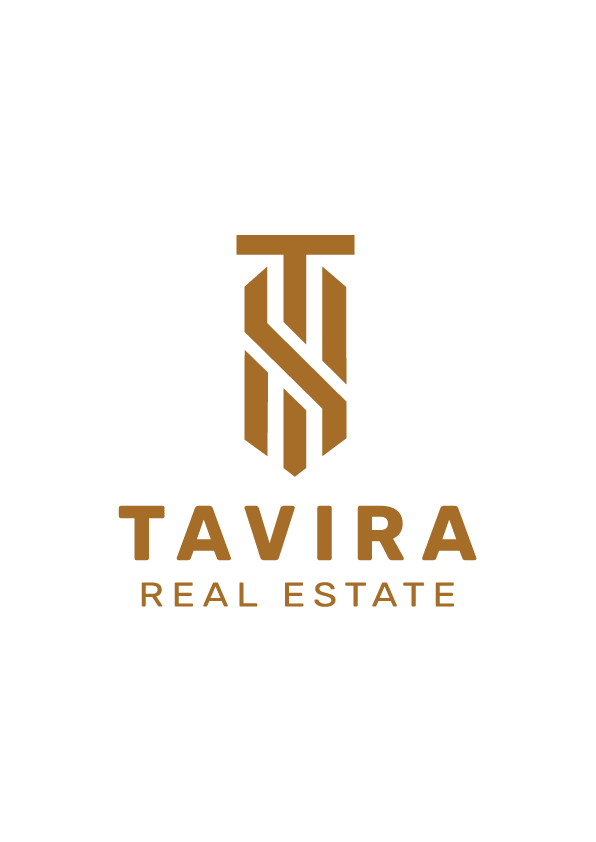

# 🏙️ ARKAN Theme

> **Luxury Brand Theme for ERPNext 16 / Frappe 16**
> *ARKAN Real Estate — Luxury Living, Refined*

<p align="center">
  <a href="https://github.com/ArkanLab/arkan_theme/actions/workflows/ci.yml"></a>
  <a href="https://github.com/ArkanLab/arkan_theme/actions/workflows/linters.yml"></a>
  
  
  
</p>



A premium, immersive brand theme that transforms ERPNext into a luxury real estate experience. Featuring an animated Dubai skyline, gold accents, glassmorphism effects, and sophisticated typography — all without modifying a single line of Frappe or ERPNext core code.

---

## ✨ Key Features

| Feature | Description |
|---------|-------------|
| 🌃 **Animated Dubai Skyline** | Iconic landmarks (Burj Khalifa, Burj Al Arab, Dubai Frame, Cayan Tower) rendered as runtime SVG with twinkling stars and animated water reflections |
| 💫 **Branded Splash Screen** | Elegant logo animation with gold underline sweep on first desk load per session |
| 🔄 **Branded Loading Indicator** | Custom overlay with spinning gold ring replaces Frappe's default freeze; auto-cleans stuck overlays |
| 🔍 **Custom Search Overlay** | Glassmorphism search panel (Ctrl+G) replaces inline awesomebar; proxies all keystrokes to Frappe AwesomeBar |
| 🎨 **Luxury Color Palette** | Gold (#DDA46F), Navy (#1D2939), Cream (#FFF1E7) — 9 core tokens + semantic colors |
| 🌙 **Time-Aware Theme** | Automatic `arkan-day` / `arkan-night` body classes updated every 60 seconds |
| ✨ **Canvas Particle Effects** | Stars, shooting stars, and gold dust particles on workspace and login pages |
| 📱 **Fully Responsive** | Optimized layouts for desktop, tablet, and mobile with adaptive star counts |
| ♿ **Accessible** | WCAG AA compliant, skip-to-content link, ARIA landmarks, reduced-motion support |
| 🖨️ **Print Ready** | Clean print stylesheet with branded headers and hidden UI chrome |
| 🔤 **Custom Typography** | Rubik (headings) + Poppins (body) font system |
| 🏗️ **Zero Core Modifications** | Purely CSS overrides + standalone JS — safe to upgrade ERPNext independently |

---

## 📦 Installation

### Prerequisites

- Frappe v16+ / ERPNext v16+
- A working Frappe bench setup
- Python 3.14+ / Node.js 24+

### Install via Bench

```bash
cd ~/frappe-bench

# Get the app
bench get-app arkan_theme https://github.com/your-org/arkan_theme.git

# Install on your site
bench --site your-site.local install-app arkan_theme

# Build assets
bench build --app arkan_theme

# Clear cache & restart
bench --site your-site.local clear-cache
bench restart
```

### Manual Installation

```bash
cd ~/frappe-bench/apps
git clone https://github.com/your-org/arkan_theme.git

echo "arkan_theme" >> ~/frappe-bench/sites/apps.txt
bench --site your-site.local install-app arkan_theme
bench build --app arkan_theme
bench restart
```

---

## 🗑️ Uninstallation

```bash
bench --site your-site.local uninstall-app arkan_theme
bench remove-app arkan_theme
bench build
# The theme is 100% removed. No residual styles or scripts.
```

---

## 🎨 Color Palette

| Token | Hex | Usage |
|-------|-----|-------|
| `--arkan-gold` | `#DDA46F` | Primary accent, buttons, links, borders |
| `--arkan-gold-light` | `#E8BE94` | Hover states, subtle highlights |
| `--arkan-gold-dark` | `#A56D29` | Active/pressed states, deep accents |
| `--arkan-navy` | `#1D2939` | Primary dark backgrounds, navbar |
| `--arkan-navy-light` | `#2A3A4D` | Sidebar, secondary dark surfaces |
| `--arkan-navy-deep` | `#111827` | Deep overlays, splash background |
| `--arkan-cream` | `#FFF1E7` | Page background, light surfaces |
| `--arkan-cream-warm` | `#FDE8D6` | Card backgrounds, hover surfaces |
| `--arkan-cream-cool` | `#FAF5F0` | Subtle background alternatives |

### Semantic Colors

| Token | Hex | Purpose |
|-------|-----|---------|
| `--arkan-success` | `#2D6A4F` | Success indicators |
| `--arkan-danger` | `#9B1B30` | Error / danger states |
| `--arkan-warning` | `#DDA46F` | Warning (uses gold) |
| `--arkan-info` | `#1D2939` | Informational (uses navy) |

---

## 📁 Architecture

```
arkan_theme/
├── README.md                          # This file
├── CONTEXT.md                         # AI-readable technical context
├── DEVELOPMENT.md                     # Developer guide
├── ROADMAP.md                         # Feature proposals & roadmap
├── CHANGELOG.md                       # Version history
├── license.txt                        # MIT License
├── pyproject.toml                     # Python package metadata
│
└── arkan_theme/                      # Main Python module
    ├── __init__.py                    # Module init
    ├── hooks.py                       # Frappe hooks (CSS/JS includes, boot)
    ├── boot.py                        # Boot session data (version, logo URLs)
    │
    └── public/                        # Static assets (symlinked to sites/assets/)
        ├── css/
        │   ├── arkan.css             # Compiled CSS (from SCSS)
        │   └── arkan.css.map         # Source map
        │
        ├── js/                        # JavaScript modules (7 files, ~2,350 lines)
        │   ├── arkan_theme.js        # Main coordinator (263 lines)
        │   ├── arkan_skyline.js      # Dubai skyline SVG renderer (1,023 lines)
        │   ├── arkan_effects.js      # Canvas particle effects (371 lines)
        │   ├── arkan_splash.js       # Splash screen controller (207 lines)
        │   ├── arkan_loading.js      # Loading indicator + freeze cleanup (145 lines)
        │   ├── arkan_navbar.js       # Navbar enhancements + search (341 lines)
        │   └── arkan_login.js        # Login page enhancements (261 lines)
        │
        ├── scss/                      # Source SCSS (12 partials, ~4,700 lines)
        │   ├── arkan.scss            # Master import + global overrides (315 lines)
        │   ├── _variables.scss        # Colors, tokens, mixins (125 lines)
        │   ├── _typography.scss       # Font families & text styles (221 lines)
        │   ├── _animations.scss       # All keyframe animations (417 lines)
        │   ├── _buttons.scss          # Button variants (297 lines)
        │   ├── _forms.scss            # Form controls & inputs (375 lines)
        │   ├── _layout.scss           # Navbar, sidebar, page-head, workspace (1,109 lines)
        │   ├── _tables.scss           # List views, data tables, filters (391 lines)
        │   ├── _cards.scss            # Widgets, number cards, charts (394 lines)
        │   ├── _modals.scss           # Dialogs, tooltips, alerts, toasts (414 lines)
        │   ├── _login.scss            # Login page glassmorphism (522 lines)
        │   ├── _splash.scss           # Splash + loading overlay + #freeze fix (188 lines)
        │   └── _print.scss            # Print styles (242 lines)
        │
        ├── images/                    # Raster images
        │   ├── splash.png             # Splash / loading logo
        │   ├── logo.png               # Main logo
        │   ├── logo-header.png        # Navbar logo
        │   ├── logo-login.png         # Login page logo
        │   ├── logo-icon.png          # Compact icon
        │   ├── arkan-nav-logo.png    # Navigation logo
        │   ├── favicon.ico            # Browser favicon
        │   ├── favicon-16x16.png      # 16px favicon
        │   ├── favicon-32x32.png      # 32px favicon
        │   ├── favicon-48x48.png      # 48px favicon
        │   └── favicon-192.png        # Apple touch / PWA icon
        │
        └── svg/                       # Vector graphics
            ├── brand-pattern.svg      # Subtle body background pattern
            ├── dubai_skyline.svg      # Static fallback skyline
            ├── arkan-logo-main.svg   # Logo (vector)
            └── arkan-watermark.svg   # Watermark overlay
```

**Total Source Code:** ~7,676 lines across 22 key files (7 JS + 12 SCSS + hooks.py + boot.py)

---

## ⚙️ JavaScript Modules

### 1. `arkan_theme.js` — Main Coordinator (263 lines)

The entry point. Sets up the `window.arkan` namespace and coordinates all modules.

- **`arkan.config`** — Central config: version, asset paths, colors, animation flags
- **`arkan.init()`** — Runs on DOMContentLoaded + `frappe.ready()`
- **`arkan.initFavicon()`** — Replaces all `<link rel="icon">` with ARKAN favicons (5 sizes)
- **`arkan.initMetaTags()`** — Appends "| ARKAN" to `<title>` via MutationObserver; sets `theme-color` meta
- **`arkan.initAccessibility()`** — Adds skip-to-content link and `role="main"` landmark
- **`arkan.initEventListeners()`** — Hooks `frappe.router.on('change')` + reduced-motion media query + time updater
- **`arkan.updateTimeAwareTheme()`** — Toggles `arkan-day`/`arkan-night` on `<body>` every 60s
- **`arkan.onPageChange()`** — Triggers `page-content-enter` CSS animation on SPA navigation
- **`arkan.initEasterEgg()`** — Konami code (↑↑↓↓←→←→BA) logs "Built by Arkan Labs" to console

### 2. `arkan_skyline.js` — Dubai Skyline SVG Renderer (1,023 lines)

The largest module. Generates an entire Dubai skyline at runtime using DOM SVG APIs.

- **`arkan.neuralGrid.create(container, options)`** — Main entry; builds full scene into a container
- **Landmarks:** Burj Khalifa (needle at y=30), Burj Al Arab (sail shape), Dubai Frame (rectangular frame), Cayan Tower (twisted silhouette), 15+ generic towers
- **Gradients:** Sky gradient (#111827 → #0D1A2B), water gradient, building gradient, gold window glow
- **Animations:** Water reflections via `<animateTransform>`, twinkling windows as `<animate>` opacity cycles
- **Options:** `fullScene`, `showStars`, `showWater`, `showReflections`, `animated`
- **Used by:** `arkan_splash.js`, `arkan_login.js`, workspace background (via CSS)

### 3. `arkan_effects.js` — Canvas Particle Effects (371 lines)

Canvas-based visual effects system with performance awareness.

- **Stars:** 80 desktop / 50 tablet / 25 mobile; 40% shimmer with sine-wave opacity; placed in top 60% of canvas
- **Shooting Stars:** Random spawn (~5–8/min at 60fps); gradient trail from white to gold
- **Gold Dust:** Floating upward particles with sine-wave drift and glow halos
- **Window Lights:** Building window glow with fade-in/hold/fade-out lifecycle
- **Safety:** Respects `prefers-reduced-motion`; auto-stops if canvas removed from DOM

### 4. `arkan_splash.js` — Splash Screen Controller (207 lines)

Branded splash screen shown once per browser session.

- **Show Conditions:** First desk load only; skips login, portal, and non-desk pages
- **Animation Sequence:** Logo fade-in (0.4s) → Gold underline sweep (0.6s) → Tagline slide-up (0.5s) → Display (2.8s) → Fade-out (0.5s)
- **Safety:** `sessionStorage` flag set BEFORE animation starts; 5s hard timeout removes overlay regardless
- **Skyline Integration:** Injects `arkan.neuralGrid.create()` as splash background if available
- **Testing:** `arkan.splash.forceShow()` and `arkan.splash.reset()` for development

### 5. `arkan_loading.js` — Loading Indicator (145 lines)

Branded loading overlay that replaces Frappe's default `#freeze` mechanism.

- **Overrides:** `frappe.dom.freeze()` → shows ARKAN overlay; `frappe.dom.unfreeze()` → removes it
- **Trigger:** `frappe.router.on('change')` calls `show()`, then `frappe.after_ajax()` calls `remove()`
- **Cleanup:** Every 2 seconds, `_cleanupFrappeFreeze()` removes stuck `#freeze` elements and orphaned `.modal-backdrop` divs
- **CSS Rule:** `#freeze { display: none !important }` in `_splash.scss` prevents Frappe's native freeze from being visible
- **Safety:** 3-second auto-remove timeout; fade-out animation (250ms)
- **Critical Insight:** Frappe's `frappe.request` is a plain object, NOT an event emitter — `frappe.request.on()` does nothing

### 6. `arkan_navbar.js` — Navbar Enhancements (341 lines)

Custom search experience and notification styling.

- **Search Bar:** Hides Frappe's inline `.search-bar`; injects a search icon SVG button
- **Search Overlay:** Glassmorphism panel with gold accent; proxies keystrokes to hidden Frappe AwesomeBar input
- **Awesomplete Integration:** Polls Awesomplete results every 200ms, clones `<li>` items into custom panel
- **Keyboard:** Ctrl+G (capture phase) opens overlay; ESC closes; Arrow keys forwarded
- **Notifications:** Adds `has-unseen` class for bell animation; polls every 3s
- **Help:** Hides `.dropdown-help` and its vertical-bar separator

### 7. `arkan_login.js` — Login Page Enhancements (261 lines)

Transforms the Frappe login page with skyline and particles.

- **Skyline Background:** Injects `arkan.neuralGrid.create()` at bottom of login page
- **Fallback Skyline:** If skyline module not loaded, generates inline SVG with landmarks + random window lights
- **Gold Particles:** Canvas-based floating particles (35 count) with sine-wave drift and glow halos
- **Brand Footer:** "© 2026 Arkan. All rights reserved."
- **Logo Enhancement:** Replaces login logo `src` with `logo-login.png`; updates heading to "Welcome to ARKAN"

---

## 🎨 SCSS Partials

| Partial | Lines | Purpose |
|---------|-------|---------|
| `_variables.scss` | 125 | Color tokens, CSS custom properties, transitions, shadows, border-radius, 4 mixins (`arkan-glass`, `arkan-card-elevated`, `arkan-gold-glow`, `arkan-focus-ring`), reduced-motion media query |
| `_typography.scss` | 221 | `@import url()` for Rubik + Poppins; heading sizes; `.frappe-control` label styles; text colors |
| `_animations.scss` | 417 | All `@keyframes`: `fadeIn`, `slideUp`, `shimmer`, `goldPulse`, `bellSwing`, `spinnerRotate`, page transitions |
| `_buttons.scss` | 297 | `.btn-primary` (gold gradient), `.btn-default`, `.btn-secondary`; hover/active/disabled states; icon buttons |
| `_forms.scss` | 375 | Input fields, selects, checkboxes, date pickers, `.frappe-control`; gold focus ring; control-label styling |
| `_layout.scss` | 1,109 | Navbar (glassmorphism `rgba(17,24,39,.8)` + blur), sidebar (dark gradient), page-head (glass effect `.82` opacity), workspace (skyline background), layout-main-section (`.92` opacity), responsive breakpoints |
| `_tables.scss` | 391 | `.frappe-list`, data tables, filters, list-row hover, sorted column headers, report view |
| `_cards.scss` | 394 | Dashboard widgets, number cards, shortcut cards, chart containers, onboarding cards |
| `_modals.scss` | 414 | `.modal-content` styling, tooltips, alerts (`.alert-*`), toasts, confirmation dialogs |
| `_login.scss` | 522 | Glassmorphism login card, animated button shimmer, forgot-password, signup, two-factor auth |
| `_splash.scss` | 188 | Splash overlay, loading overlay, loading ring animation, `#freeze { display: none !important }` |
| `_print.scss` | 242 | `@media print` rules, branded header, hidden navbar/sidebar, clean typography, page breaks |
| `arkan.scss` | 315 | Master imports + global overrides: indicator pills, scrollbar styling, `.page-container`, `.desk-page` |

---

## 🛠️ Development Commands

```bash
# ─── SCSS Compilation ───
cd apps/arkan_theme/arkan_theme/public
npx sass scss/arkan.scss css/arkan.css --style compressed --source-map

# Watch mode (auto-recompile on save)
npx sass --watch scss/arkan.scss:css/arkan.css --style compressed

# ─── Build & Deploy ───
bench build --app arkan_theme
bench --site dev.localhost clear-cache

# ─── Full Rebuild Cycle ───
cd apps/arkan_theme/arkan_theme/public && \
npx sass scss/arkan.scss css/arkan.css --style compressed --source-map && \
cd /workspace/development/frappe-bench && \
bench build --app arkan_theme && \
bench --site dev.localhost clear-cache
```

---

## 🎛️ Customization

### Change Brand Colors

Edit `_variables.scss` — all colors flow through CSS custom properties:

```scss
$arkan-gold: #YOUR_COLOR;
$arkan-navy: #YOUR_COLOR;
$arkan-cream: #YOUR_COLOR;
```

Then recompile SCSS and rebuild.

### Change Logos

Replace images in `public/images/`:
- `splash.png` — Splash screen & loading overlay logo
- `logo-header.png` — Navbar brand logo
- `logo-login.png` — Login page logo
- `favicon.ico` + `favicon-*.png` — Browser favicons

### Disable Features

```javascript
// In browser console or custom script:
arkan.config.animations.enabled = false;  // Disable all animations

// Disable specific modules:
// Comment out the line in hooks.py app_include_js array
```

### Change Fonts

Edit `_typography.scss` — update the `@import url()` and `font-family` declarations.

---

## 🧪 Browser Support

| Browser | Minimum Version |
|---------|----------------|
| Chrome | 90+ |
| Safari | 15+ |
| Firefox | 90+ |
| Edge | 90+ |
| iOS Safari | 15+ |
| Android Chrome | 90+ |

**Required Features:** CSS Custom Properties, `backdrop-filter`, `MutationObserver`, `requestAnimationFrame`, Canvas 2D

---

## ⚠️ Upgrade Safety

This theme is designed to be **100% upgrade-safe**:

- Uses **only** CSS overrides and standalone JavaScript
- **Zero modifications** to Frappe or ERPNext core files
- All styles use CSS custom properties for maintainability
- Safe to upgrade ERPNext independently
- If visual conflicts occur after an ERPNext upgrade, update CSS selectors accordingly

---

## 🐛 Troubleshooting

### Styles not loading
```bash
bench --site your-site.local clear-cache
bench build --app arkan_theme
```

### Splash screen not showing
The splash only shows once per browser session. To test:
```javascript
arkan.splash.forceShow();
```

### Loading overlay stuck
The 3-second safety timer should auto-remove it. The periodic cleanup (every 2s) also removes stuck Frappe `#freeze` elements. If persistent:
```javascript
arkan.loading.remove();
arkan.loading._cleanupFrappeFreeze();
```

### Dark overlay appears on page
This is usually Frappe's `#freeze` element. The theme's CSS hides it (`#freeze { display: none !important }`), but if it persists after a bench upgrade, rebuild CSS:
```bash
cd apps/arkan_theme/arkan_theme/public
npx sass scss/arkan.scss css/arkan.css --style compressed --source-map
bench build --app arkan_theme
```

### Animations slow on mobile
Users can enable "Reduce motion" in their OS accessibility settings. The theme automatically detects and disables all animations.

---

## 📄 License

MIT License — see [license.txt](license.txt)

---

## 👥 Credits

| | |
|---|---|
| **Publisher** | Arkan Labs |
| **Email** | info@arkanlabs.com |
| **Framework** | Frappe v16 / ERPNext v16 |
| **Design** | Dubai luxury real estate aesthetic |
| **Fonts** | [Rubik](https://fonts.google.com/specimen/Rubik) · [Poppins](https://fonts.google.com/specimen/Poppins) |
| **License** | MIT |

---

*Built with ❤️ by Arkan Labs — ARKAN: Luxury Living, Refined* 🏙️

## Contact

For support and inquiries:
- Phone: +201508268982
- WhatsApp: https://wa.me/201508268982

