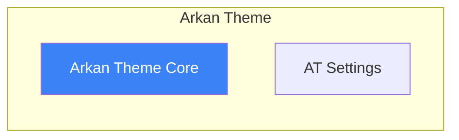

# Arkan Theme — Module Map
# أركان ثيم — خريطة الوحدات

```mermaid
graph LR
    subgraph Arkan Theme
        Core["Arkan Theme Core"]
        Settings["AT Settings"]
    end
    style Core fill:#3B82F6,color:#fff
```

> **Note:** This is a placeholder module map. Update with actual modules from `modules.txt`.
